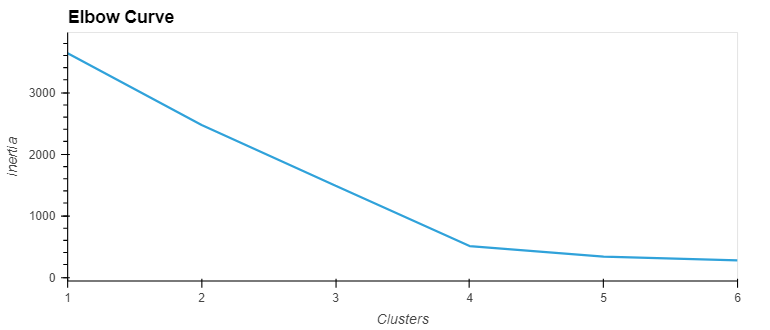
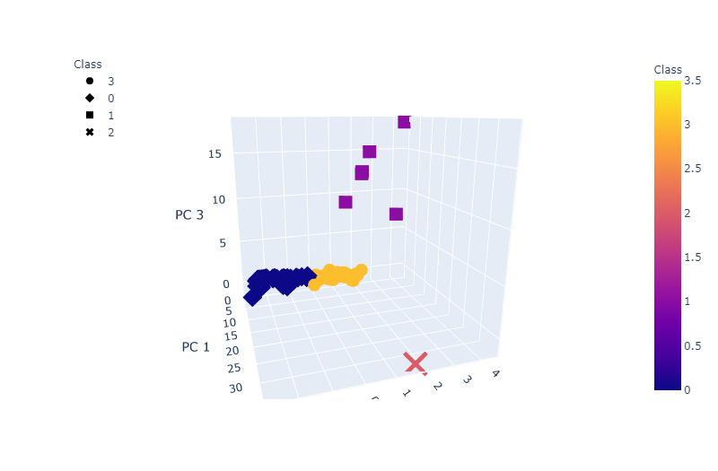
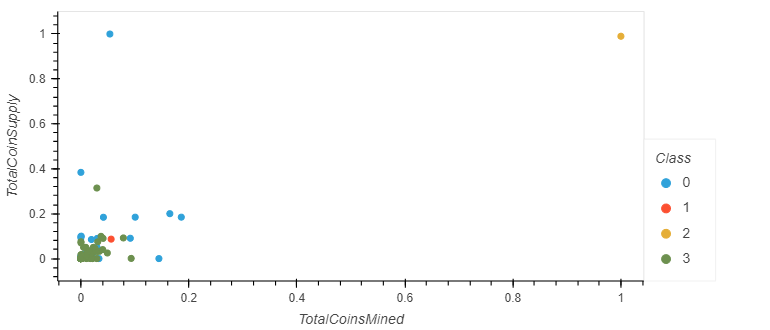

# PCA and Kmeans using Cryptocurrency
## Project Overview
* Preprocess data for dimensionality reduction
* Use Kmeans to determine the optimal number of clusters
* Vizualize clusters
### Elbow Curve

Selecting 4 clusters as a result of the elbow curve
### 3D Clustering

Jupyter Lab will not display this 3D visualization, use Jupyter Notebook.

### Total Supply v Total Mined Curve

Exploratory graph
BitTorrent is in a class of its own. 
VeChain, BiblePay, LitecoinCash, Poa Network, Acute Angle Cloud, and Waves are in a class together.
The roughly 500 other coins are evenly split between the other two classes.  